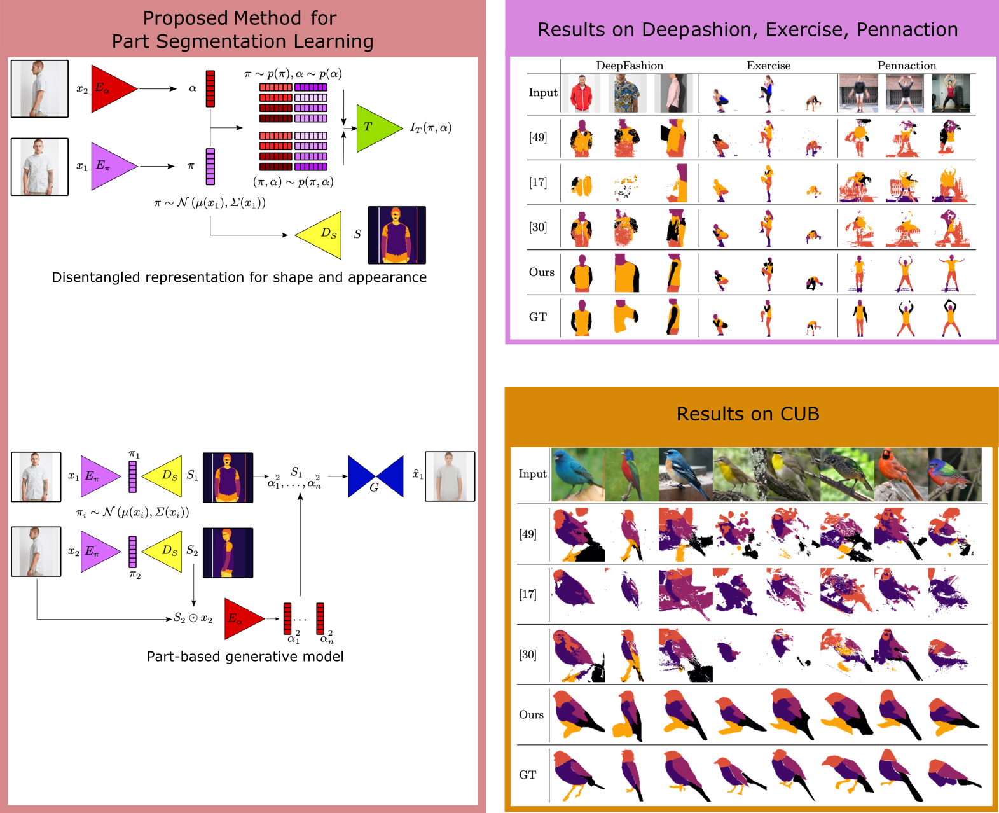

# Unsupervised Part Discovery by Unsupervised Disentanglement

Code accompanying the [GCPR 2020]() paper

[**Unsupervised Part Discovery by Unsupervised Disentanglement**](https://compvis.github.io/unsupervised-part-segmentation/index.html)<br/>
[Sandro Braun](https://github.com/therealsupermario),
[Patrick Esser](https://github.com/pesser),
[Björn Ommer](https://hci.iwr.uni-heidelberg.de/Staff/bommer)<br/>

<br/>
[arXiv](https://arxiv.org/abs/2009.04264) | [BibTeX](#bibtex) | [Project Page](https://compvis.github.io/unsupervised-part-segmentation/index.html)

Table of Contents
=================

* [Requirements](#requirements)
* [Training](#training)
   * [Data](#data)
* [Evaluation](#evaluation)
* [Pretrained Models](#pretrained-models)
* [BibTeX](#bibtex)


## Requirements
A suitable [conda](https://conda.io/) environment named `braun20parts` can be created
and activated with:

```bash
conda env create -f environment.yaml
conda activate braun20parts
```

Clone the repo **with all it's submodules**

```bash
git clone --recursive -j8 git@github.com:CompVis/unsupervised-part-segmentation.git
```


## Training

1. For running experiments into the respective subfolders `deepfashion`, `cub` and `pennaction`.
2. Experiments can be run using [edflow](https://github.com/edflow/edflow).

```
edflow -t xxx/<config.yaml>
```
### Data

* The CUB dataset is the same as in [Lorenz19](https://arxiv.org/pdf/1903.06946.pdf), but we manually added semantic part segmentations and added them in the repo.

## Evaluation

1. baseline models with pretrained checkpoints on all datasets can be found in folder `baselines`
2. evaluation scripts and notebooks can be found in folder `evaluation`

## Pretrained Models

pretrained models can be found in the respective folder, under `train/checkpoints`

## BibTex

```
@inproceedings{braun2020parts,
  title={Unsupervised Part Discovery by Unsupervised Disentanglement},
  author={Braun, Sandro and Esser, Patrick and Ommer, Bj{\"o}rn},
  booktitle={Proceedings of the German Conference on Computer Vision},
  year={2020}
}
```
